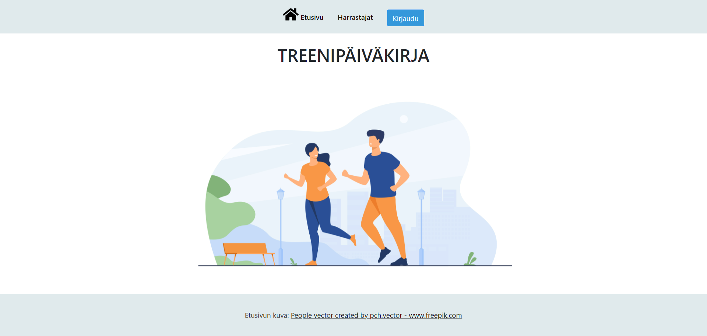
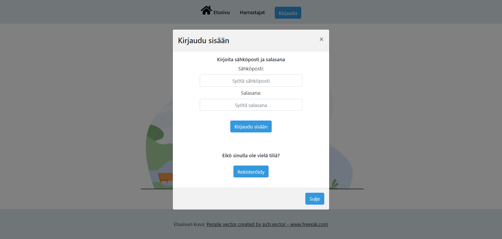
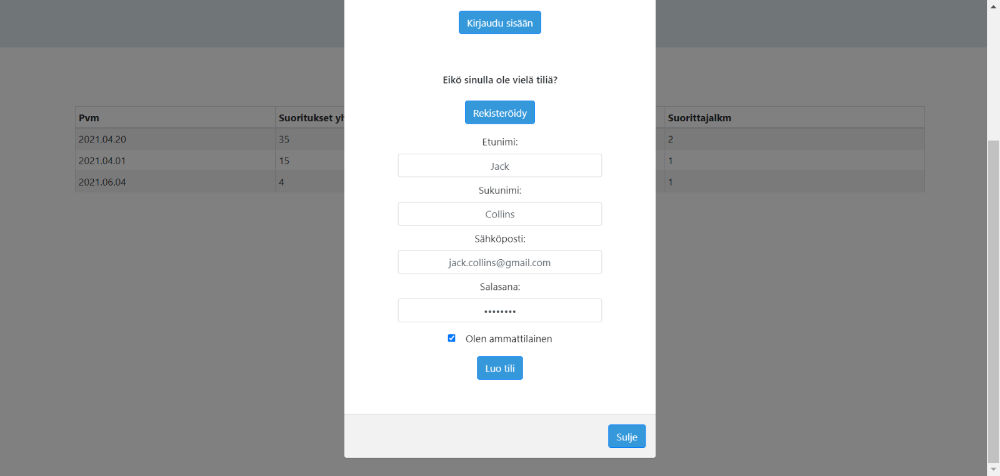
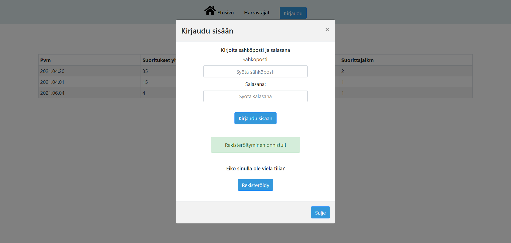
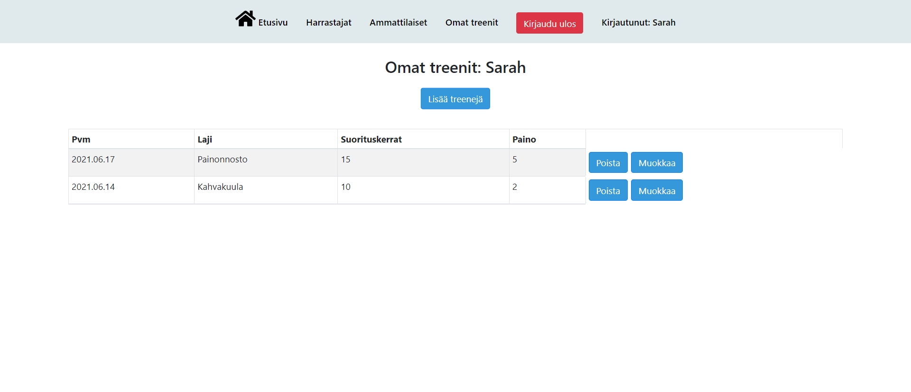
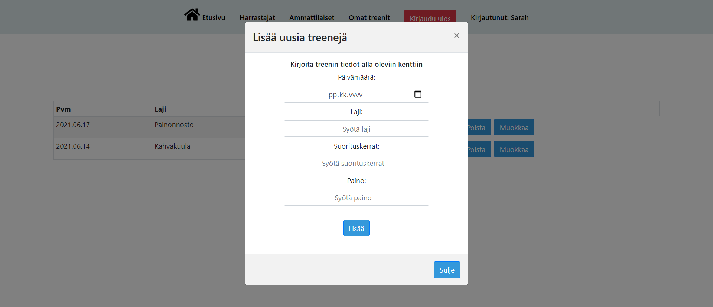
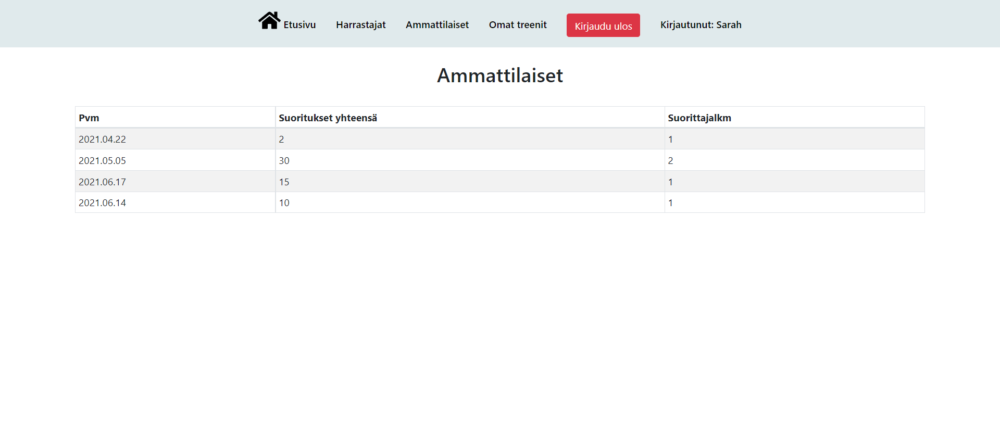

## Exercise diary
This application is for tracking how much you do sports. The users can sign in to the app and after that they can save the information of their exercises to the app. There are two user types in the application: amateurs and professionals. This application is not completely ready yet.

|Table of contents|
|:------------- |
|1. [Technical solutions of the application](#Technical-solutions-of-the-application)|
|2. [Pictures of the user interface](#Pictures-of-the-user-interface)|

## Technical solutions of the application
Used technologies: **HTML, CSS, JavaScript, ReactJS, Node.js, MongoDB**.

### Styling
I have used **React Bootstrap** in all the elements of the application. Picture of the main page is from https://www.freepik.com/home. The home icon in the navigation bar is from https://fontawesome.com/.

## Pictures of the user interface

This is the view when the user opens the application.

Here the user can log in.

If the user wants to sign in to the application, they can click the "Rekisteröidy" button in the log in window and then fill in their information to the fields that appear to the window.

After signing in, the user sees a message that the registeration has succeeded. If the registeration didn't succeed, the user sees a message of that.

Here the user can see their own exercises, add new exercises, edit them or delete them.

Here is the view for adding new exercises. The view for editing the exercises is very similar.

The users that have logged in can also watch how the professionals have done exercises.

The users that have logged in can also watch how the amateurs have done exercises. This page is also available for the users that have not logged in to the application.

